# AWS VPC Transit Gateway

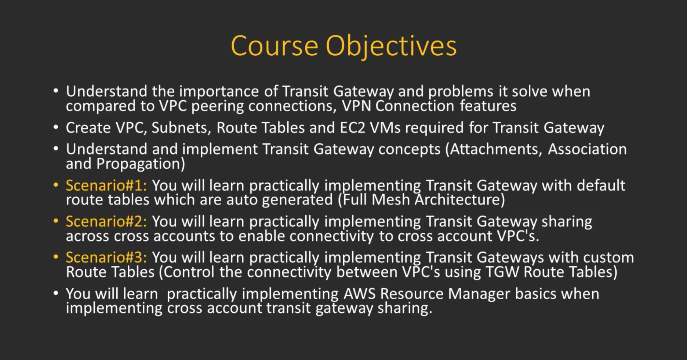

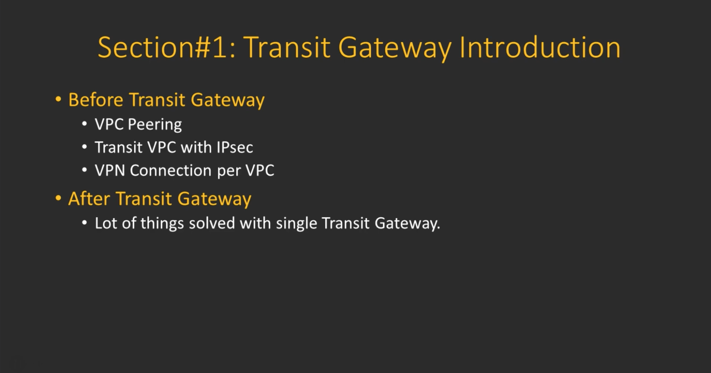

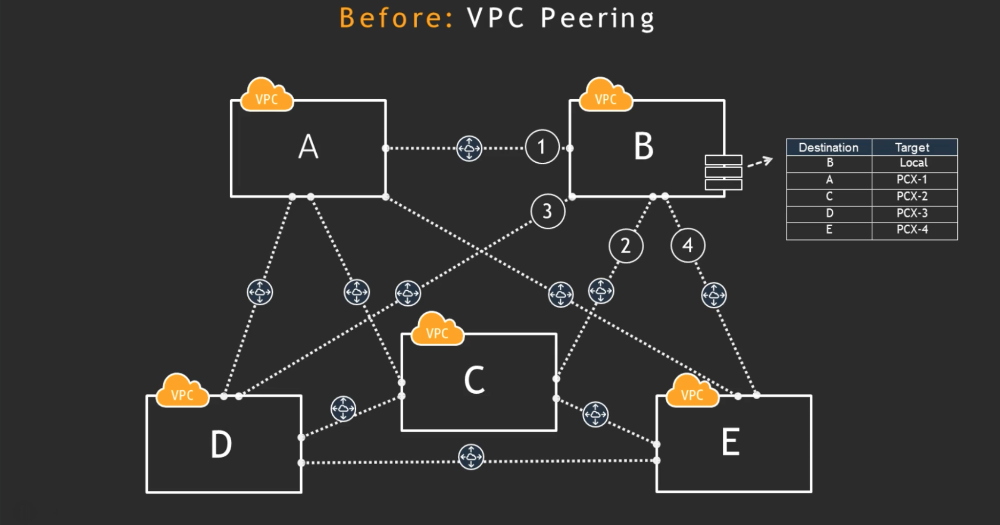

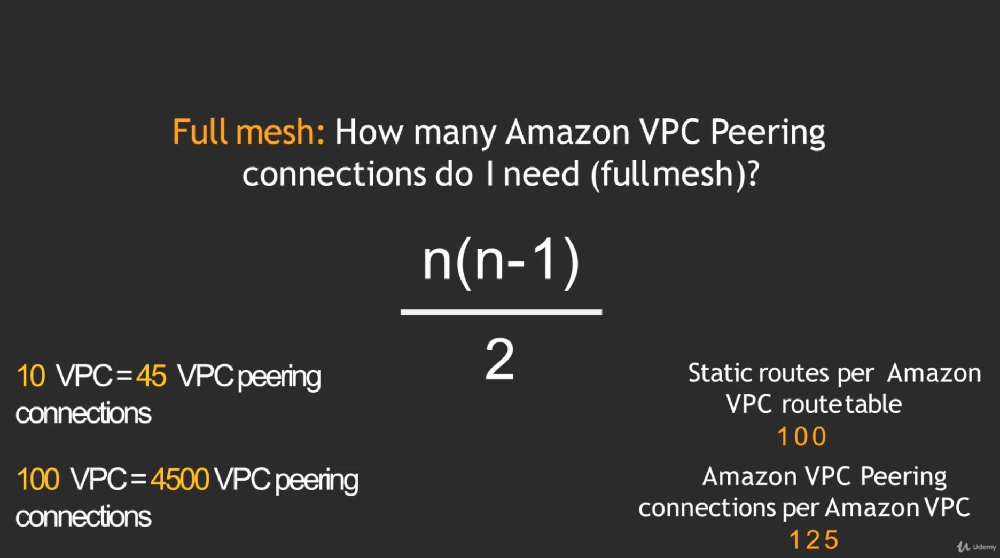

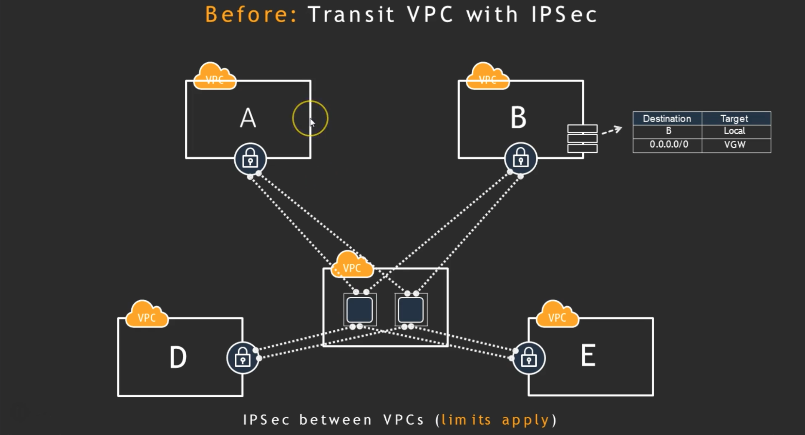

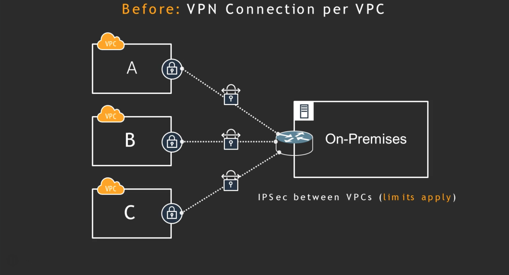

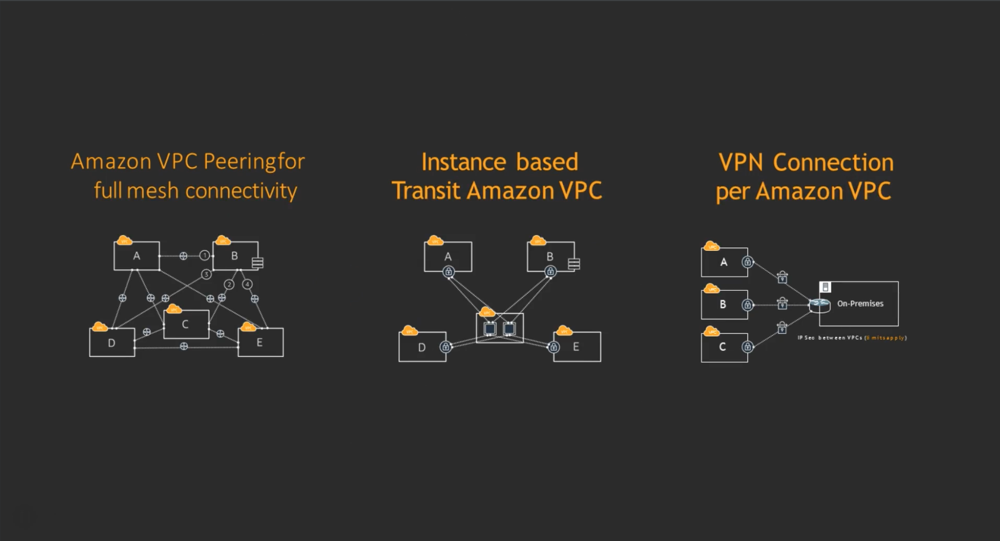

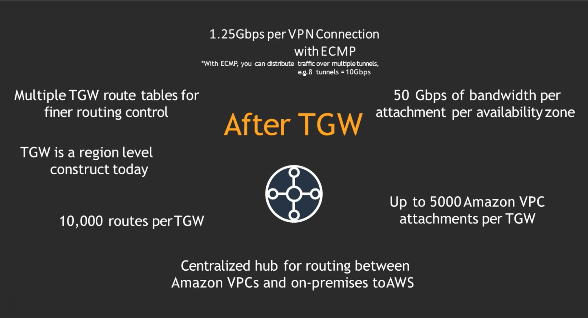

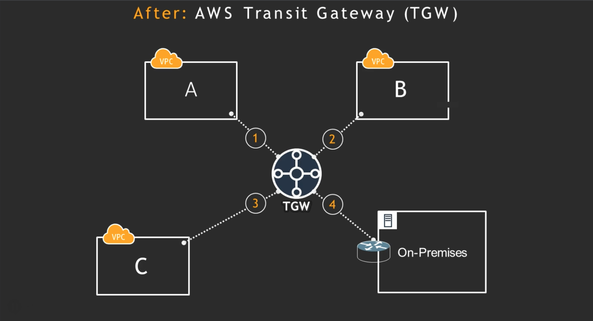

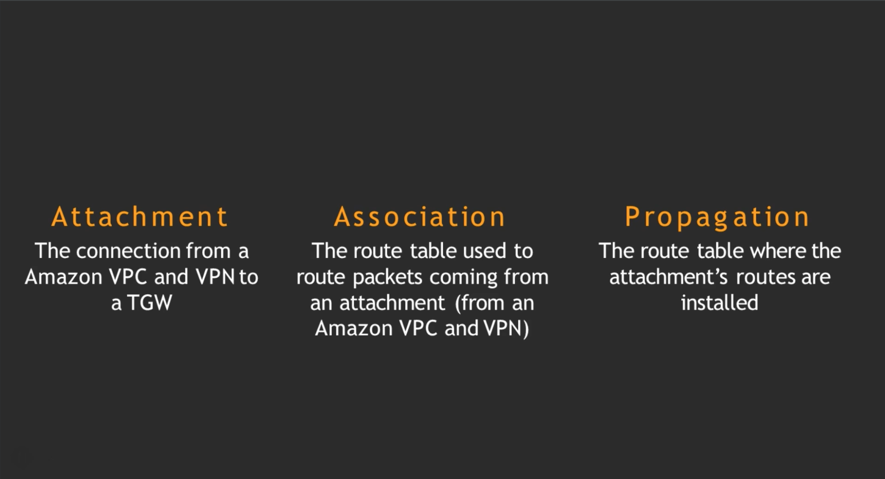

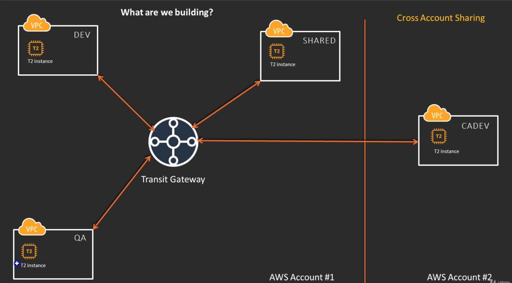

## Create VPC, Subnets, Internet Gateways, Route tables

If we create a subnet that is not part of the transit gateway attachments then inter VPC/EC@ VM communications doesn't work. We will have to attach the subnet to transit gateway attachement for that particular VPC to VM's communicate with each other across VPC's

