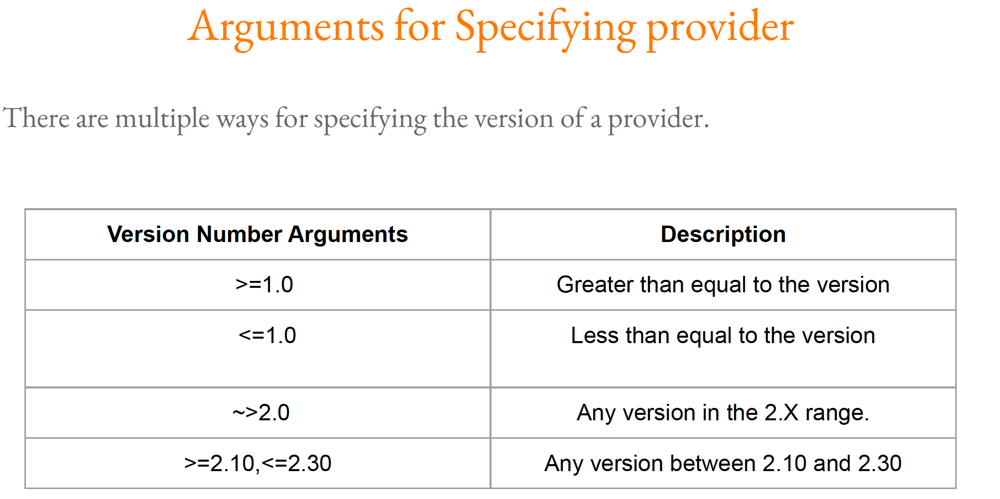

# DevOps - Terraform Certified Associate - 2023

## Configuration Management

Ansible, puppet, chef are configuration management software tools to install and manage softwares on existing servers

## Infrastructure Management

Terraform, CloudFormation are infrastructure orchstration tools, that means they are used for server and resource(s) provisioning

Configuration management tools can be used for infrastructure provisioning as well up to some degree but the focus should be on configutation and not provisioning

**Infrastructure As a Code and Configuration Management work together well.**

### Download Terraform

[Install Terraform](https://developer.hashicorp.com/terraform/downloads)

[Terraform documentation](https://registry.terraform.io/)

HashiCorp also provides extension for Terraform for Visual Studio Code. So please consider using IDE like Visual Studio Code.  
There are more IDE's like ATOM or sublime too.  

1. Create AWS account with email id as username and password  
2. Use IAM to assign the your username as Adminstrator Access  
3. Create access key and secret keys and copy down to local text editor (this will used for future use)  
4. Create a file with .tf extension in local workspace
5. Run following commands in order
   1. `terraform init`
   2. `terraform plan`
   3. `terraform apply`
   4. `terraform destroy` - (optional) when you want to destroy all your resources

6. Your ec2 instance should be created now (wait for it to be created and in running stage to verify in aws EC2 dashboard)
7. `terraform destroy -target github_repository.example`  is an example to destroy specific github resource
8. 

### footnotes

1. Whenever a new provider is mentioned, `terraform init` needs be run,
2. There can be multiple resource blocks and providers in main .tf file,
3. Resources are identified in combination of resource type and custom resource name,
4. There are 3 types of providers as official (HashiCorp), Partner (HashiCorp Partner) and community (Individual Contributors)
5. Provider namespaces - Namespaces are used to help users identify the organization or publisher responsible for the integration,
6. Terraform requires explicit source information for any providers that are not HashiCorp-maintained, using a new syntax in the required_providers nested block inside the terraform configuration block,
7. The -target option can be used to focus Terraform's attention on only a subset of resources,
8. If the resource code is commented out, terraform asumes that resource is not longer needed and it will try to destroy that resource (if the resource was already created), **(try running terraform destroy command two times without changing the resource configuration)**
9. Terraform tries to ensure that the deployed infrastructure is based on the desired state. If there is a difference between the two, terraform plan presents a description of the
changes necessary to achieve the desired state,
10. 
11. If we change the actual resource configuration manually on the server, the we need to run `terraform refresh` command to refresh the tfstate file so that the current configuration is reflected in the tfstate, (**Be careful before using this command, may lead to confusing state**)
12. It's important to know that upgrading the provide plugin version can be done via `terraform init -upgrade` command, this will download the latest version for that provider plugin,
13. `terraform apply -auto-approve` command is used for quick resource creation, (this command skips the approval and straght goes and creates the resources)
14. **Do not hardcode the authentication credentials in tf files**,
15. use cli (for e.g. awscli) to set the authentication credential,
16. Follow below to configure authentication credentials:
17. run `aws configure` -> prompts you to enter aws access key, secret access key, region(optional),
18. When terraform apply runs, the current state of resource is fetched (if already created) and terraform matches to the Terraform configuration and if required the update/create process happens,
19. **Resource configuration represents desired state in Terraform**
20. 