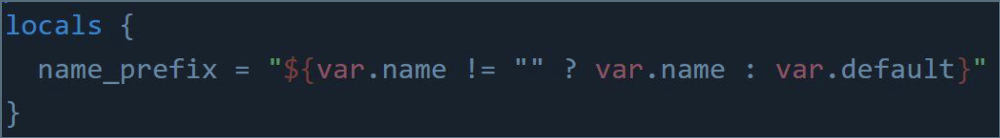

# READ, GENERATE and MODIFY

1. Attributes are the fields in a resource that hold the values that end up in state,
2. Terraform allows us to reference the attribute of one resource to be used in a
different resource,
3. add the reference attributes to tf file (Please refer [this](./reference-attributes.tf)) file
   1. `terraform init` -> `terraform plan` -> `terraform apply` OR  `terraform apply -auto-approve`
   2. **make sure that you `terraform destroy -auto-approve` after everything is confirmed becayse aws charges for aws eip's we created**
4. **Output values**: Output values make information about your infrastructure available on the command line, and can expose information for other Terraform configurations to use,
   1. Please refer [this](./output-values.tf) file
   2. `terraform apply -auto-approve`
   3. `terraform destroy -auto-approve`
5. terraform variable files are always have extension .tfvars,
6. We should use this tfvars file for defining the values for the vars,
7. Then we can use the var in the actual tf file for use. Works like a template,
8. If for any reason, we don't want to use "terraform.tfvars" as a file name(which is default to terraform definition) then we have to use below command as a result: `terraform {your command} -var-file="custom.tfvars"`
9. **Data Types**:
   1. The type argument in a variable block allows you to restrict the type of value that will be accepted as the value for a variable for e.g

   ```text
      variable "image_id" {
         type = string  
      }
   ```

   2. String, list, map, number are the data types,
   3. For aws elb example [refer this](https://github.com/terraform-aws-modules/terraform-aws-elb/blob/master/variables.tf)
10. **Environment Variables**:
    1. setx TF_VAR_instancetype t2.large (Windows)
    2. export TF_VAR_instancetype="t2.nano"
       echo $TF_VAR (Linux/Mac)
11. Fetching data from maps and list: Please refer [this](./fetch-values-variables.tf)
12. **Count Parameter and Index**:
    1. under resource we can mention count and the terraform will spin up those many resources for us, Please refer [this](./count-paremeter.tf)
    2. count.index — The distinct index number (starting with 0) corresponding to this instance. See [this](./count-index.tf) example, another version [here](./count-index_v1.tf)
13. **Conditional Expressions**:
    1. A conditional expression uses the value of a bool expression to select one of two values. See [this](./conditional.tf) example

14. **Local Values**: A local value assigns a name to an expression, allowing it to be used multiple times within a module without repeating it. For e.g. see [this](./localvarsdemo.tf) file,
    1. Local Values can be used for multiple different use-cases like having a conditional expression. For e.g. see ,
    2. Local values can be helpful to avoid repeating the same values or expressions multiple times in a configuration,
    3. If overused they can also make a configuration hard to read by future maintainers by hiding the actual values used Use local values only in moderation, in situations where a single value or result is used in many places and that value is likely to be changed in future,
15. **Functions**: [built-in functions](https://developer.hashicorp.com/terraform/language/functions) that you can use to transform and combine values
    1. Terraform language does not support user-defined functions, and so only the functions built in to the language are available for use
       1. Numeric
       2. String
       3. Collection
       4. Encoding
       5. Filesystem
       6. Date and Time
       7. Hash and Crypto
       8. IP Network
       9. Type Conversion 
    2. Please refer [this](./functions.tf) file
16. **Data sources**: allow data to be fetched or computed for use elsewhere in Terraform configuration. Please refer [this](./datasources.tf) file. If you need to find more details related to options that can be used in filters, you can refer to the following AWS documentation: 
https://docs.aws.amazon.com/cli/latest/reference/ec2/describe-instances.html
Refer to the --filters option
17. **Dynamic Blocks**: Dynamic Block allows us to dynamically construct repeatable nested blocks which is supported inside resource, data, provider, and provisioner blocks
    1. a [raw resource file](./raw_dynamic_block.tf) could quickly become very complicated and diffuclt to maintain,
    2. This problem could be solved by [dynamic blocks](./dynamic_block.tf)
18. If we use ```terraform apply -replace="aws_instance.{resource}``` then the terraform takes care of taint functionality offered by terraform, {resource} to be replaced with actual resource name, ```terraform taint``` can be used in older terraform versions,
19. **Splat Expression**: allows us to get a list of all the attributes, see [this](splat.tf) file
20. ```terraform graph```: command is used to generate a visual representation of either a
configuration or execution plan, output of terraform graph is in the DOT format, which can easily be converted to an image, Please see [this dot file](./graph.tf) and [this file](./graph.dot)] for visual graph. Please remember to install graphviz extension for dot files preview in vscode,
21. 
