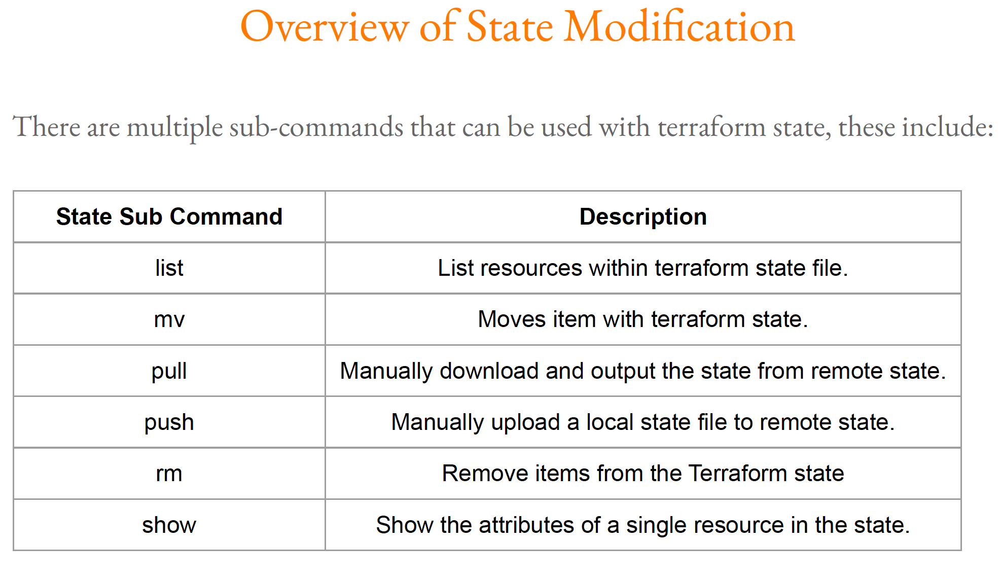

# State Lock

State is always locked on lockable resources by default

We can avoid the lock on resource by -lock=false

a temporary .terraform.tfstate.lock.info file is generated while resources are locked and removed automatically as soon as resource lock is completed



Sub command List
```terraform state list```

The terraform state mv command is used to move items in a Terraform state.
This command is used in many cases in which you want to rename an existing resource without destroying and recreating it.
Due to the destructive nature of this command, this command will output a backup copy of the state prior to saving any changes

```terraform state mv [options] SOURCE DESTINATION```

The terraform state pull command is used to manually download and output the state from
remote state.

The terraform state push command is used to manually upload a local state file to remote state
