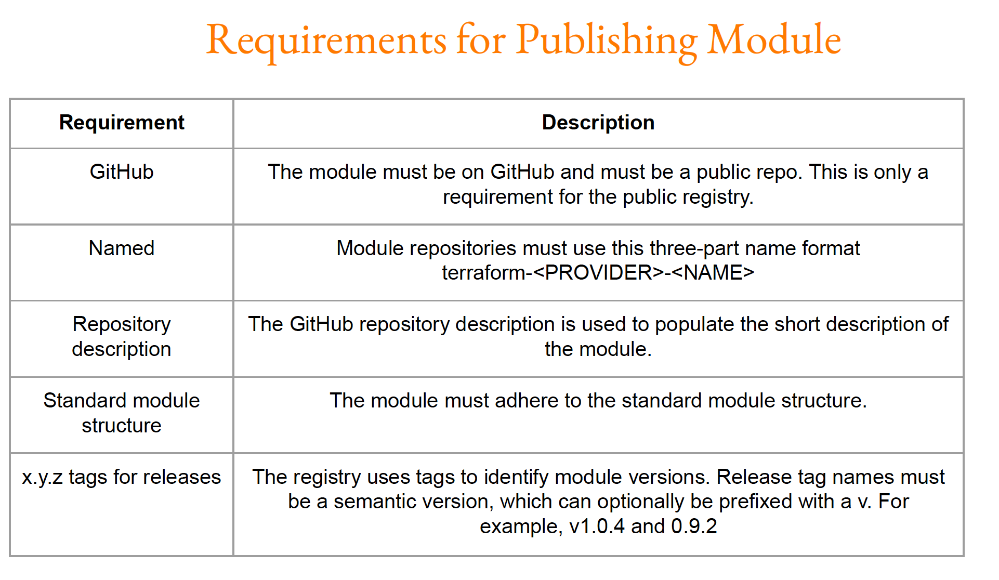
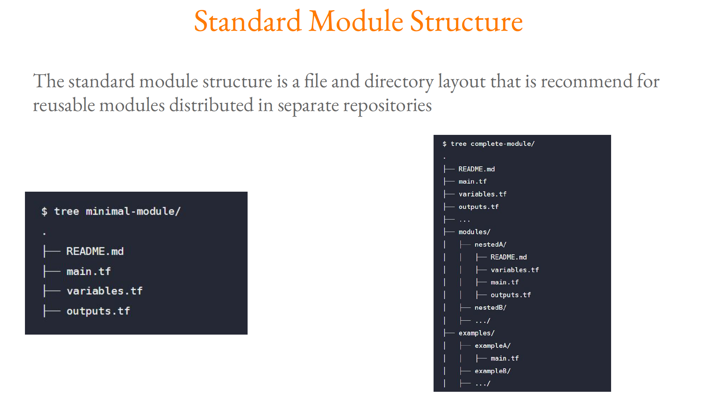

# Terraform Registry

The [Terraform Registry](https://registry.terraform.io/) is a repository of modules written by the Terraform community.

**Verified Modules in Terraform Registry**:
Within Terraform Registry, you can find verified modules that are maintained by various third party vendors.
These modules are available for various resources like AWS VPC, RDS, ELB and others

Verified modules are reviewed by HashiCorp and actively maintained by contributors to stay
up-to-date and compatible with both Terraform and their respective providers.

The blue verification badge appears next to modules that are verified

Module verification is currently a manual process restricted to a small group of trusted
HashiCorp partners.

## Publishing Modules

## Standard Module structure
